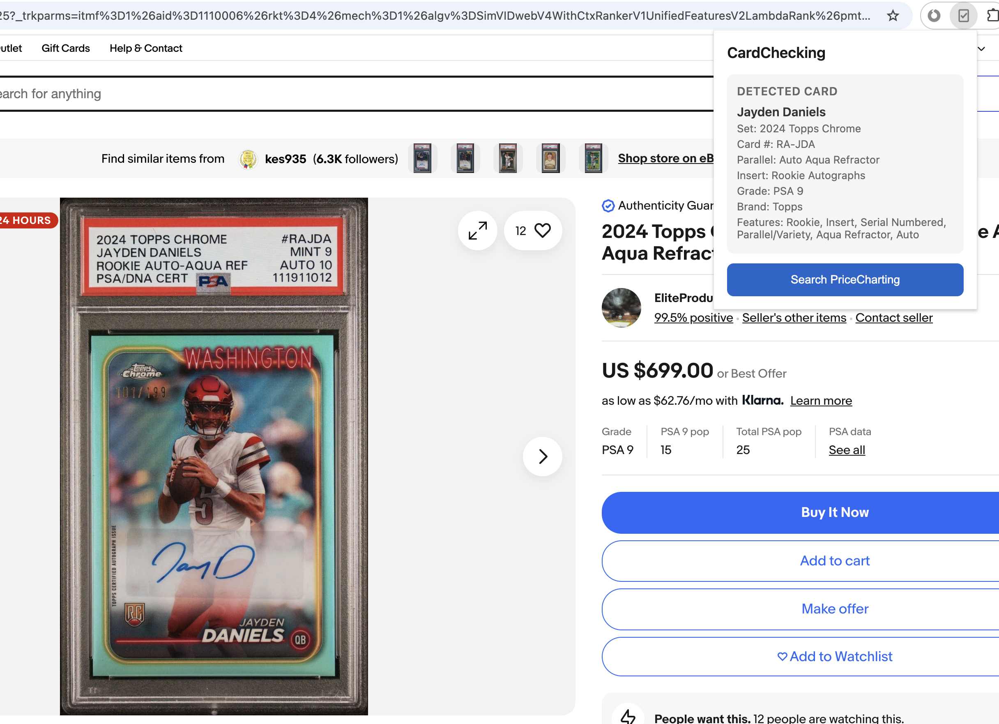
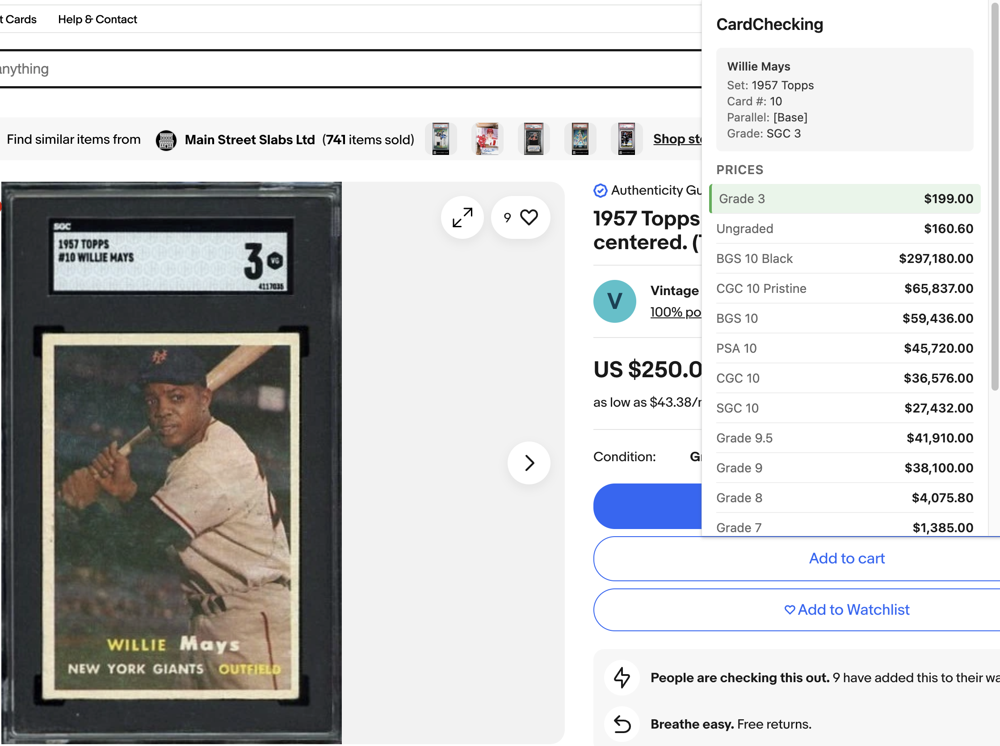
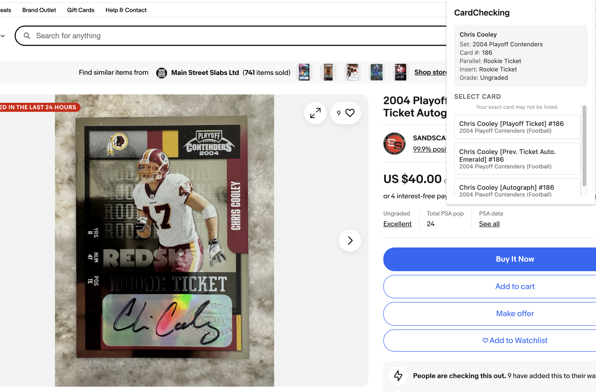

# CardChecking

A Chrome extension that helps card collectors check prices while browsing eBay listings. Supports sports cards, trading card games (TCGs), and non-sport collectible cards.

## Screenshots

**Detected Card & Price Lookup**


**Price Comparison by Grade**


**Multiple Match Selection**


## Features

- **Automatic card detection** - Extracts card name, year, set, card number, and grade from eBay Item Specifics
- **Real-time pricing** - Fetches current market prices from SportsCardsPro and PriceCharting
- **Smart routing** - Sports cards go to SportsCardsPro, TCGs and non-sport cards go to PriceCharting
- **Grade matching** - Highlights the price for your card's specific grade
- **Multi-grader support** - Works with PSA, BGS, SGC, CGC, CSG, HGA, and more

### Supported Card Types

**Sports Cards**
- Baseball, football, basketball, hockey, soccer, golf, tennis, boxing, wrestling, racing, MMA

**Trading Card Games (TCGs)**
- Pokémon, Magic: The Gathering, Yu-Gi-Oh!, Digimon, One Piece TCG, Disney Lorcana

**Non-Sport Collectibles**
- Star Wars, Marvel, Garbage Pail Kids, and more

## Installation

### From Chrome Web Store
*(Coming soon)*

### Manual Installation (Developer Mode)
1. Clone this repository
2. Open Chrome and go to `chrome://extensions/`
3. Enable "Developer mode" (top right)
4. Click "Load unpacked" and select the repository folder

## Usage

1. Navigate to any eBay card listing (sports, TCG, or collectible)
2. Click the CardChecking icon in your toolbar
3. View detected card info and click the search button
4. Browse prices across all grades

## How It Works

The extension:
1. Reads eBay's Item Specifics to extract card metadata (with title parsing as fallback)
2. Determines the card type (sports, TCG, or non-sport)
3. Routes to the appropriate pricing database:
   - Sports cards → SportsCardsPro
   - TCGs and non-sport cards → PriceCharting
4. Displays current market prices by grade
5. Highlights the matching grade for easy comparison

Card not detected correctly? Use the "Report it" link to submit an issue with pre-filled debug info.

## Privacy

- No personal data is collected or stored
- No accounts required
- Card data is only sent to SportsCardsPro or PriceCharting for price lookups

## Development

Run the test suite:
```bash
node tests/run-tests.js
```

## Credits

Price data provided by [SportsCardsPro.com](https://www.sportscardspro.com) / [PriceCharting.com](https://www.pricecharting.com)

## License

MIT
